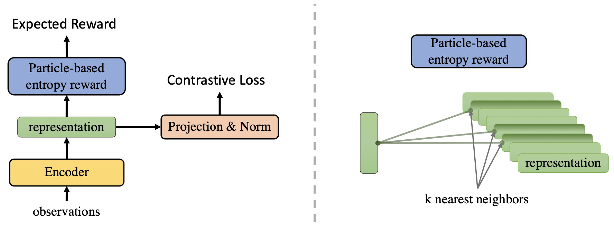

This is the official code for the paper [Behavior From the Void: Unsupervised Active Pre-Training](https://arxiv.org/abs/2103.04551).

## Abstract
> We introduce a new unsupervised pre-training method for reinforcement learning called APT, which stands for Active Pre-Training. APT learns behaviors and representations by actively searching for novel states in reward-free environments. The key novel idea is to explore the environment by maximizing a non-parametric entropy computed in an abstract representation space, which avoids the challenging density modeling and consequently allows our approach to scale much better in environments that have high-dimensional observations (e.g., image observations). We empirically evaluate APT by exposing task-specific reward after a long unsupervised pre-training phase. On Atari games, APT achieves human-level performance on 12 games and obtains highly competitive performance compared to canonical fully supervised RL algorithms. On DMControl suite, APT beats all baselines in terms of asymptotic performance and data efficiency and dramatically improves performance on tasks that are extremely difficult to train from scratch.

## TL;DR
> A simple yet effective method for unsupervised pre-training in RL via particle-based entropy maximization.

## Method Diagram


## Configuration
The experiment environemnt is provided in [this conda env](env/env.yaml).
```markdown
# conda env
conda env create -f env.yaml -y
conda activate apt
# jupyter notebook (for visualization)
conda install -c conda-forge notebook jupyter notebook jupyter_nbextensions_configurator jupyter_contrib_nbextensions -y
```

## Usuage
```markdown
# Run Atari/DMC training code
# Coming soon

# Run GridWorlds training code (the code should complete within 30 mins with a modern GPU)
jupyter notebook --NotebookApp.iopub_data_rate_limit=10000000000 --no-browser --port=8890
```
