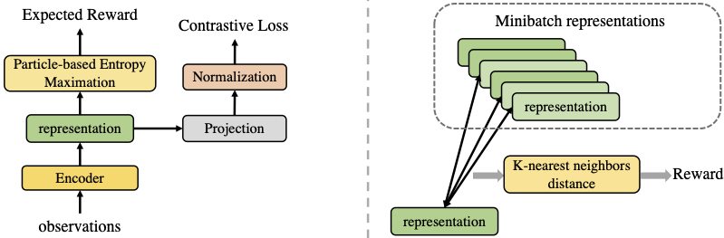

Code for reproducing experiments in [Behavior from the void: unsupervised active pre-training](https://arxiv.org/abs/2103.04551). It consists of unsupervised pretraining in single Atari environment, and subsequently adapt to downstream reward function.

The code is ported out with maximum readability in mind, it can hopeful serve as a simple starting point for future research.

## Model

## Usage
Run `python train.py --env_name space_invaders`

## Todo
- [ ] include hyperparameter setting as config
- [ ] yaml for requirement
- [ ] reward plotter
- [ ] double q learning
