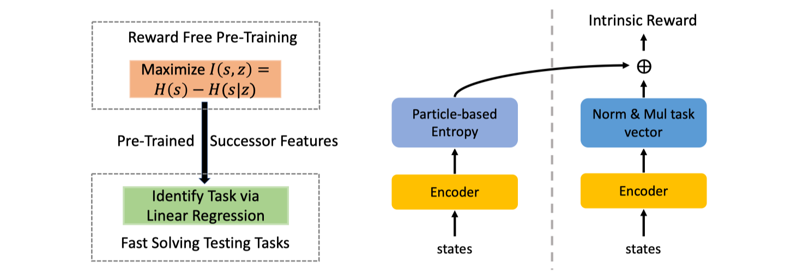

This is an implementation of Active Pre-Training with Successor Features.

## TLDR
> The proposed method Active Pre-Training with Successor Feature (APS) explores the environment via nonparametric entropy maximization, and the explored data can be efficiently leveraged to learn behavior by variational successor features. APS addresses the limitations of existing mutual information maximization based and entropy maximization based unsupervised RL, and combines the best of both worlds.

## Method Diagram

## Usuage
Arxiv and documentation coming soon.
